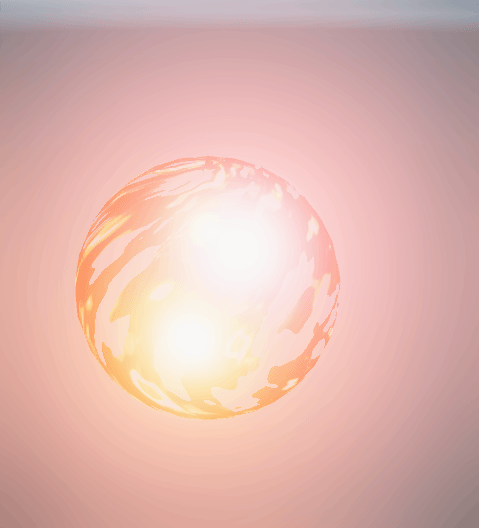
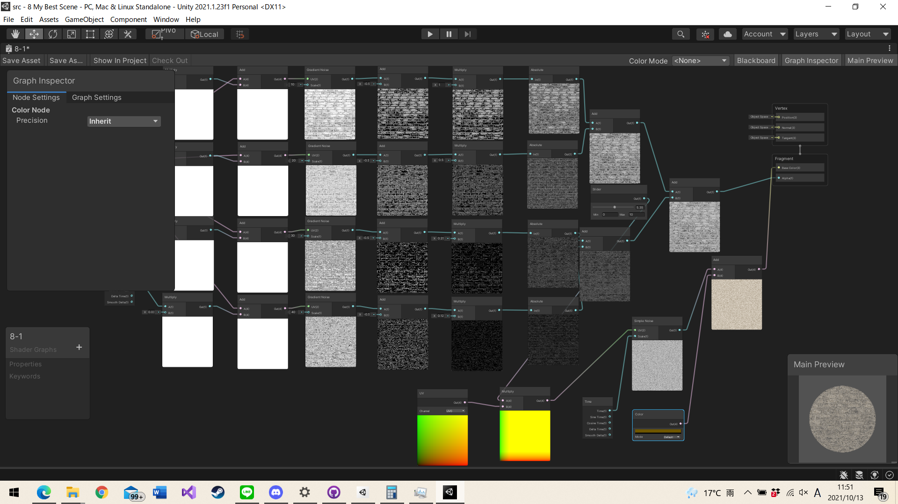

# ノイズを使ったディゾルブ
主にシェーダを使ってループアニメーションを実装します。

# 自分なりに変更した点
- シェーダーグラフを3種類追加しました。(Floor,sphere,cylinder)
- パーリンノイズに色を指しました。
- Color Maskを使い、ノイズの模様を変更しました。
- ディゾルブに使うテクスチャを変更しました。
- thresholdをTimeノードに変更することで、自動で消滅と出現を繰り返すようになりました。
- いろいろ遊んでたらノイズの外郭だけ光が灯りました。
- リムライトの話(おまけ)と、ReplaceColorを使うことで、ノイズ内で段階的に色を変更しました。

# 進め方

- 本リポジトリをフォークしてください
- フォークしたリポジトリをcloneします
- Unityのプロジェクトを更新して実装してください。
  - 結果画像1（一番上の画像）と同じシーンを「1 Simple Scene」に実現してください
  - 結果画像2（二番目の画像）と同じシーンを「2 Scaling Scene」に実現してください
  - 結果画像3（三番目の画像）と同じシーンを「3 FBM Scene」に実現してください
  - 結果画像4（四番目の画像）と同じシーンを「4 Anim Scene」に実現してください
  - 結果画像5（五番目の画像）と同じシーンを「5 Alpha Clip Scene」に実現してください
  - 結果画像6（六番目の画像）と同じシーンを「6 Clip Noise Scene」に実現してください
  - 結果画像7（六番目の画像）と同じシーンを「7 Desolve Scene」に実現してください
  - 自分なりにかっこいいシーンを「8 My Best Scene」に作成してください
- このテキストファイルに変更点を記載してください
- 「8 My Best Scene」の結果をUnity RecorderでAnimation GIFをとして保存し、result.gifをという名前にして本ディレクトリの物と差し替えてください（サイズが大きくて上げられない場合は、解像度を小さくするなどして下さい）
- node_graph.pngを自分のシェーダグラフの一番頑張ったノードと差し替えてください
- プルリクエストを出して提出してください
